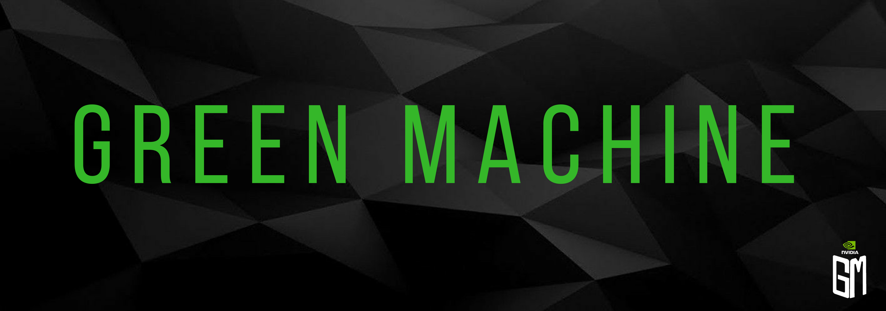

Green Machine is a kiosk that detects cafeteria objects and projects colored boxes onto them based on their waste type (compost, recycling, trash, and reusable). The goal is to make it easy for people to quickly know which bin to throw their waste in, avoiding confusion and guessing.

**This project is open-source under an MIT license. See [LICENSE.md](https://github.com/NVIDIA-Jetson/GreenMachine/blob/master/LICENSE.md).**


---

## Quickstart Guide

### Requirements

* A [Jetson TX2](https://developer.nvidia.com/embedded/buy/jetson-tx2) flashed with [Jetpack 3.2](https://developer.nvidia.com/embedded/dlc/jetpack-l4t-3_2_1) (The TX2 developer kit comes pre-flashed)
* A CSI Camera (Included in the developer kit)
* A 720p or greater projector (Optional)

### Install GreenMachine

Turn on your Jetson and log in with the username `nvidia` and password `nvidia`.

Download [this TensorFlow wheel](https://nvidia.app.box.com/v/TF180-Py27-wTRT) and move it to your home directory.

In a terminal window, type this (without the `$`) to download GreenMachine: 

```bash
$ git clone https://github.com/NVIDIA-Jetson/GreenMachine
```

Then install GreenMachine and its dependencies:

```bash
$ cd ..
$ cd GreenMachine/src
$ python GreenMachine.py --install
```

Next, Follow [this guide](https://github.com/NVIDIA-Jetson/argus_camera#setup) to install the Argus Camera library.

Finally, install tf_trt_models:

```bash
$ git clone --recursive https://github.com/NVIDIA-Jetson/tf_trt_models.git
$ cd tf_trt_models
$ ./install.sh
```

### Run GreenMachine

Then run (with a projector):

```bash
$ python Calibrate.py
$ python GreenMachine.py
```

Or without a projector:

```bash
$ python GreenMachine.py --screen
```

---

## Full Guide

### Requirements and Prerequisites

**Hardware:**

* A Jetson TX2
* A CSI Camera (Included in Jetson TX2 Developer Kit)
* A 720p Projector (Optional)

**Software:**

* A JetPack 3.2 (Pre-Flahsed in the Jetson TX2 Developer Kit)
* A Host Machine running Ubuntu 16.04 (Optional, only needed for training)

### Setup

If you have a projector, you can see examples of projector/camera mounts on [this wiki page](https://github.com/wiki_link). It is difficult to set up a mount and match the projector and camera's field of views, but once you do, projector mode can be used.

If you just have a monitor or do not want to mount the projector, you can still run GreenMachine in screen mode. All you need for this mode is some sort of display.

If your Jetson is not already flashed (which it should be if you have the developer kit), follow [this guide](https://developer.download.nvidia.com/embedded/L4T/r27_Release_v1.0/BSP/l4t_quick_start_guide.txt?dmNEgaGVAc9lf3H4Zpt9Hgi42fvHQKaiiFg-JA2U0f8ZjHighQ-kr1B5TldAn1Ag88i12pHldQl0UjfzqQJvKO2ISDfm2PcVSgm9-DqbTjx2fUlFVeEONp0muUW2Y4edRduB2stirRPBYJFWhSpzWkp5VnOIXQwA0QY) to flash it before you start installation.

### Installing

**Install Dependencies:**

First, download [this TensorFlow wheel](https://nvidia.app.box.com/v/TF180-Py27-wTRT).

Then use `pip` to install dependencies (in the same directory that the TensorFlow wheel is in):

```bash
$ sudo pip install numpy
$ sudo pip install opencv-python
$ sudo pip install matplotlib
$ sudo pip install pillow
$ sudo pip install tensorflow-1.8.0-cp27-cp27mu-linux_aarch64.whl
```

Then install tf_trt_models:

```bash
$ git clone --recursive https://github.com/NVIDIA-Jetson/tf_trt_models.git
$ cd tf_trt_models
$ ./install.sh
```

Finally, follow [this guide](https://github.com/NVIDIA-Jetson/argus_camera#setup) to install the Argus Camera library.

**Download GreenMachine:**

Clone the repo:

```bash
$ git clone https://github.com/NVIDIA-Jetson/insert-link-here.git
```

**Run GreenMachine:**

If you have a projector setup, you will need to calibrate GreenMachine. You only need to run this on the first run or if you move the camera or projector.

```bash
$ python Calibrate.py
```

If you have a projector, run GreenMachine normally:

```bash
$ python GreenMachine.py
```

Or without a projector, use `--screen`:

```bash
$ python GreenMachine.py --screen
```

In the terminal, you should see the text "Loading...". After a few more seconds, a loading screen should come up on your projector or screen. If these do not happen, refer to [Common Errors](#Common%20Errors).

It should take about two to three minutes to load. This is to optimize the model for quick inferencing, and is only done on startup.

After two to three minutes, the loading screen should disappear and you should be able to inference on objects in front of the camera. If not, refer to [Common Errors](#Common%20Errors).

### Common Errors

**Camera not found:**

Try these debugging steps:

1. Make sure you have a camera that is connected to the Jetson via CSI, not USB.
2. Check that the camera is using port 0.
3. Disconnect all USB devices that aren't your mouse or keyboard.
4. Delete and reinstall GreenMachine and it's dependencies.

**Module not found:**

Try these debugging steps:

1. Uninstall pip modules:

```bash
$ sudo pip uninstall opencv-python
$ sudo pip uninstall numpy
$ sudo pip uninstall tensorflow-1.8.0-cp27-cp27mu-linux_aarch64.whl
```

2. Reinstall them:

```bash
$ sudo pip install opencv-python
$ sudo pip install numpy
$ sudo pip install tensorflow-1.8.0-cp27-cp27mu-linux_aarch64.whl
```

3. Delete the tf_trt_models folder, then re-install it:

```bash
$ rm -rf tf_trt_models
$ git clone --recursive https://github.com/NVIDIA-Jetson/tf_trt_models.git
$ cd tf_trt_models
$ ./install.sh
```

4. Restart

---

## About

### EnviroNet

EnviroNet is a convolutional neural network trained on top of [MobileNet SSD v1](https://github.com/tensorflow/models/blob/master/research/object_detection/g3doc/detection_model_zoo.md). It detects and classifies nine different types of objects commonly found in cafeterias and kitchens. You can learn more about EnviroNet [here](https://github.com/NVIDIA-Jetson/GreenMachine/wiki/Training).

**EnviroNet Classes:**

* cup (cup/soup bowls)
* rutensil (silverware)
* tutensil (plastic utensils)
* container (paper containers and to-go boxes)
* plate (bowls and plates)
* paper (napkins)
* stick (chopsticks and coffee stirrers)
* bottle (water and drink Bottles)
* wrapper (food and candy wrappers)

*EnviroNet: Coming to a trash can near you!*

### Inference

Inference is done on a Jetson TX2 with TensorFlow's [object detection API](https://github.com/tensorflow/models/tree/master/research/object_detection) and NVIDIA's [tf_trt_models](https://github.com/NVIDIA-Jetson/tf_trt_models).

**Benchmarks (Jetson TX2):**

* Create model/optimize: 122.5 seconds
* Inference: 40 ms (25.0 fps)
* Inference + Draw bboxes: 45 ms (22.2 fps)
* Inference + Draw bboxes + Render: 51 ms (19.6 fps)

### Authors

GreenMachine was made by high school interns Karly Hou, Shruthi Jaganathan, and Isaac Wilcove at NVIDIA during the summer of 2018.
